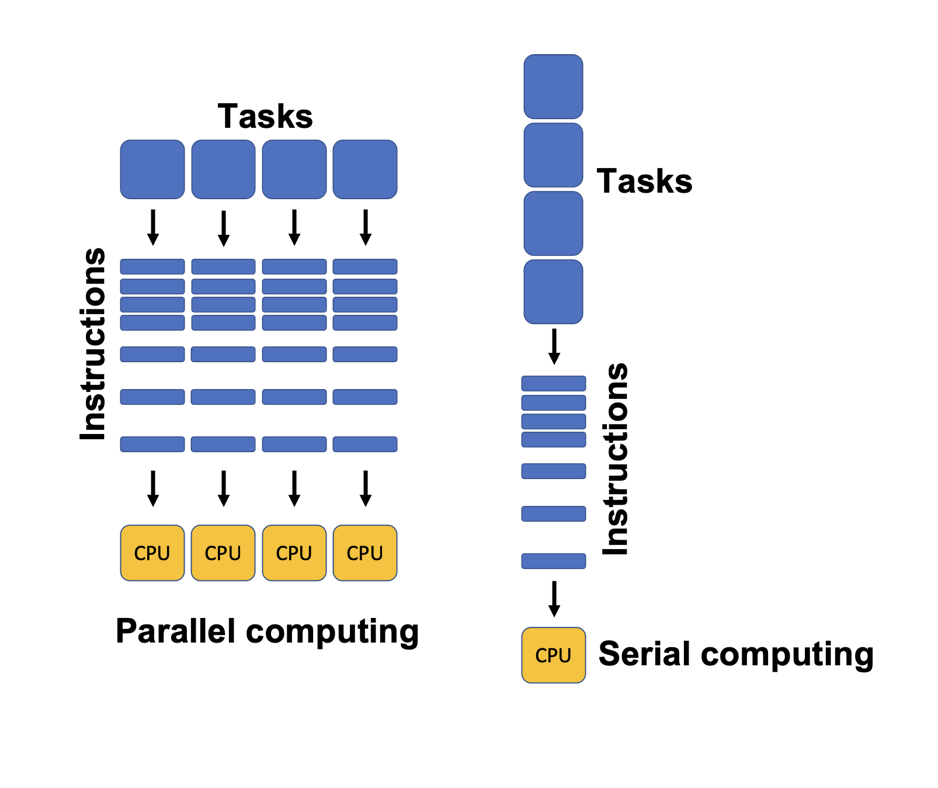
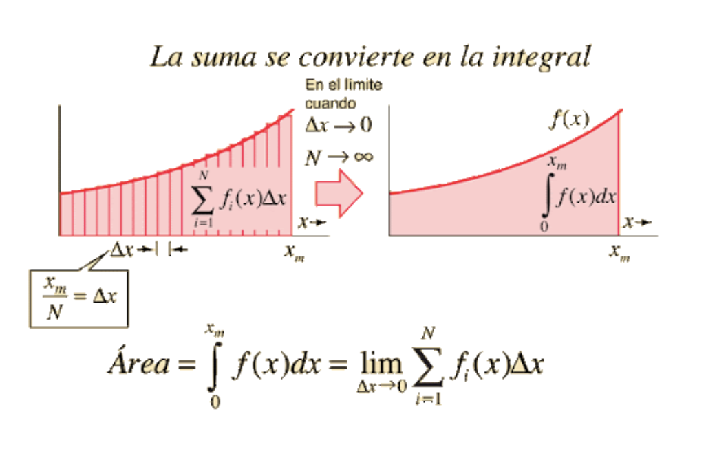

# Introduction
Santiago Lillo Macías
2026-03-28

## What is Parallelism?

Imagine you want to build a wall. You are the only worker, and the task will take you a reasonable amount of time. Also, you can only take one step at a time. You can't put the second brick after you are done with the first one. This is common sense.

But now imagine we have 2 workers to build the wall. Of course, 2 is better than 1. The workers can divide the wall into two halves, and spend half the time. Also, a very important thing is how to set the two halves together in order to be a unique wall, and not two.

- _Parallelism_ is computing multiple tasks simultaneously. Computers have multiple CPU's, kernels, or any hardware that allows us to distribute different tasks.
- _Serial_ computing is what we are used to when we learn to program: do this task, __then__ this other one, and so on.



## Race Condition

A problem that arises is how to manage shared resources, such as memory. Imagine that two workers want to take a brick exactly at the same time. Or, they have to add 1 anytime they use a brick. If they do is exactly at the same time, only 1 is added, but two bricks were used.

Example:

```{text}
a = 6
Instructions for worker 1: add 1 to a
Instructions for worker 2: add 1 to a

Worker 1 ---- +1 ----> a <---- +1 ---- Worker 2

a = 7 ¡But it should be 8!
```

## Setting up all together

When the two workers end their job, they have to manage how to "glue" both halves. The client wants one wall, not two, but he doesn't care if it was built by two, three or sixty seven workers. Thus, when parallel computing, we will have to take the results of each parallel process and add them all up (if adding them is the case).

Each parallel task is a serial task, locally. When building the wall, if it's 10 bricks width, you could pay 10 workers, but adding more won't change anything. Each worker has to do his job  with "serial computing".

## What is concurrency?

Concurrency is not parallelism itself. It is how to deal with it. Imagine you are at a narrow bridge, and two cars arrive at the same time to the bridge. You could handle it in different ways: the one who has more priority in some way, the one who drives faster, the biggest one, ... 

All these topics will be discussed in this project. In this file, we start with a basic example.

# Multiprocessing 

We will compute an integral with two different methods: sequential and parallel computing. 

Let the function be

``` python
def sucesor(x:int) -> int:
    return x+1
```

We may want to know the sucesor of `[2,5,9]`.

-Option one: `for i in ...`

-Option two (Good!): use `map`. Of course the `for` loop is easier to implement and better if you have a small input (and better to understand too!), but we are thinking of BIG inputs, such as vectors with a millions of numbers.

``` python
resultados1 = pool.map(sucesor, [2,5,9])
print('suma pool map = ', resultados1)
```

`map` calculates sucesor(2), sucesor(5) and sucesor(9) at the same time.
The first line does a __lazy evaluation__, so it won’t show the result unless we ask for it. We do so on the second line.

``` text
suma pool map =  [3, 6, 10]
```

Let the function be

``` python
def suma(x:int, y:int) -> int:
    return x+y
```

Remark this function takes two arguments. We cannot use
`map(suma,[(1,1),(3,5),(9,3)])`, because it will take the `(1,1)` input as a whole, and not as two arguments. Solution: `starmap` converts `suma((x,y))` into `suma(x,y)`.

``` python
from itertools import starmap
resultados2 = pool.starmap(suma,[(1,1),(3,5),(9,3)])
print('suma pool starmap = ',resultados2)
```

We do the same as before.

``` text
suma pool starmap =  [2, 8, 12]
```

But what is this `pool` thing? Before using it, we have to create a `Pool`:

``` python
pool = Pool()
```

Going back to the workers example. Imagine you have 10 workers and you are the boss. Then, with that line you are saying “Hey, workers, get ready to start. You will have to do a job separately”. By default, the system will create whatever number of phisically avaliable kernels on your computer. Usually it will be 8. You can chek that with `cpu.count()`. If you want a specific number N of processes, you shall write

``` python
pool = Pool(N)
```

and depending on your hardware, and if it’s working on some other things, you could possibly get N processes, but not always.

# Integral

Remember the basic definition of integral of $f$: "infinite" sum of areas below $f$. 

Since we can't compute inifinite areas "by brute force", we will make an approximation; maybe thousands or millions of little areas. That's where we'll use parallel computing. It's unfeasible to fo a `for i in range(1_000_000)` loop. That's why we will distribute the task into different segments or sections of the interval.



Our area function is this:

```{python}
def area_rect(una_funcion: Callable[[float], float],inf: float, sup: float) -> float:
    return (sup - inf) * una_funcion((inf + sup) / 2)
```

Serial and parallel functions are:

```{python}
def integral_sec(la_funcion: Callable[[float], float], inf: float, sup: float, cant_interv: int) -> float:
    tareas = [(la_funcion, inf + i * (sup - inf) / cant_interv, inf + (i + 1) * (sup - inf) / cant_interv) for i in range(cant_interv)]
    resultados = starmap(area_rect, tareas)
    return sum(resultados)

def integral_paral(una_funcion: Callable[[float], float], inf: float, sup: float, cant_interv: int, cant_tareas: int, cant_proc: int= None) -> float:
    tareas_subintervalos = [(una_funcion, inf + i * (sup - inf) / cant_tareas, inf + (i + 1) * (sup - inf) / cant_tareas, cant_interv//cant_tareas) for i in range(cant_tareas)]
    pool = Pool(cant_proc)
    resultados = pool.starmap(integral_sec, tareas_subintervalos)
    return sum(resultados)
```

In the parallel one, we create a Pool of processes, then compute the serial integral of every little subinterval, and the sum up everything.

# Example

It's better to write `if __name__ == '__main__':`. `Pool` can do strange things.

We compute the $sin$ integral from $0$ to $\pi$. Wee divide into $10^7$ subintervals.

```{python}
if __name__ == '__main__':

    pool = Pool()
    
    to = perf_counter()
    res_integral_sec = integral_sec(math.sin, 0, math.pi, 10**7)
    t1 = perf_counter()
    print('Resultado de integral secuencial: ', res_integral_sec)
    print('Tiempo integral secuencial sin pool = ', t1-to)
    
    print(' ')

    def integral_paral(una_funcion: Callable[[float], float], inf: float, sup: float, cant_interv: int, cant_tareas: int, cant_proc: int= None) -> float:
        tareas_subintervalos = [(una_funcion, inf + i * (sup - inf) / cant_tareas, inf + (i + 1) * (sup - inf) / cant_tareas, cant_interv//cant_tareas) for i in range(cant_tareas)]
        pool = Pool(cant_proc)
        resultados = pool.starmap(integral_sec, tareas_subintervalos)
        return sum(resultados)
    
    to = perf_counter()
    res_integral_paralela = integral_paral(math.sin, 0, math.pi, 10**6, 50, 20)
    t1 = perf_counter()
    print('Resutado integral paralela = ', res_integral_paralela)
    print('Tiempo integral con pool = ', t1-to)
    #el resultado debe aproximarse lo máximo a 2
```

Terminal:

```{text}
Resultado de integral secuencial:  2.0000000000000084
Tiempo integral secuencial sin pool =  7.069091207929887
 
Resutado integral paralela =  2.0000000000008225
Tiempo integral con pool =  0.7082101659616455
```

The result is the same (considering floating point errors). Parallel procedure is 10 times faster.
